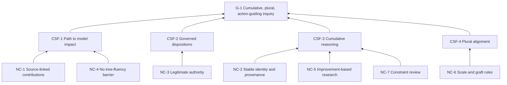

# Goal Tree

## Purpose

Define the enduring conditions required for the Research Circle to create
cumulative, plural, action-guiding inquiry.

## Entities

**G-1 — Goal**

2R inquiry becomes cumulative, plural, and action-guiding through a continually
improving shared model.

**Critical Success Factors**

- CSF-1 — Contributions have a path from expression to model impact.
- CSF-2 — Model changes receive legitimate, transparent, reversible
  dispositions.
- CSF-3 — The model preserves reasoning, evidence, disagreement, and downstream
  implications.
- CSF-4 — Trees align across scales without erasing autonomy or difference.

**Necessary Conditions**

- NC-1 — Contributions remain linked to source.
- NC-2 — Model objects and revisions have stable identity and provenance.
- NC-3 — Standing, review, objections, and authority are explicit.
- NC-4 — Participation does not require tree fluency.
- NC-5 — Research is judged by model improvement and relevance.
- NC-6 — Scale boundaries and grafting rules are explicit.
- NC-7 — Uptake flow and the current research constraint are reviewed.

## Logical connections

L-001–L-004 state that all four CSFs are necessary for G-1. L-005–L-011
connect the necessary conditions to their CSFs.

Necessity reading:

> To make inquiry cumulative, it is necessary that contributions can alter the
> shared model; that changes are legitimate; that their reasoning survives;
> and, for the full vision, that alignment does not erase local difference.

## Evidence

EVD-4–EVD-10, with EVD-8 providing the strongest direct evidence for the
Research Circle goal.

## Assumptions

ASM-1 and ASM-4–ASM-7. CSF-4 is least certain: federation is necessary for the
full collective-intelligence vision, but not for the first research pilot.

## Confidence

High for G-1 and CSF-1–CSF-3; medium for CSF-4's position as immediately
necessary.

## Open reservations

- Who is the beneficiary of the Research Circle's improved model?
- What makes a delta an improvement rather than a change?
- Can the group succeed locally before solving cross-scale grafting?

## Diagram

Text: source-linked, accessible contributions support uptake; legitimate
authority supports governance; provenance, relevance, and review support
cumulative reasoning; graft rules support plural alignment; all serve G-1.

## Cross-tree references

RC-1 threatens CSF-1. RC-2 threatens CSF-2. RC-3 and UDE-3 threaten CSF-3.
RC-5 and UDE-7 threaten CSF-4.

