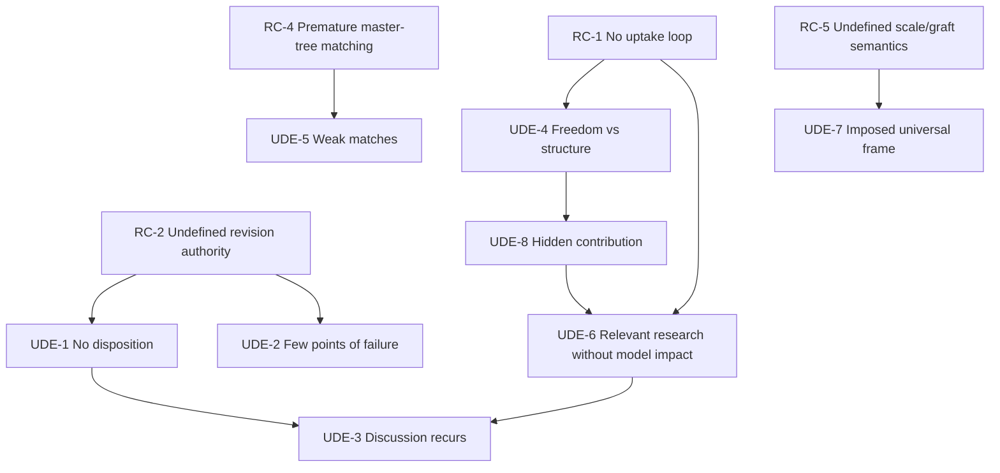

# Current Reality Tree

## Purpose

Explain why Research Circle contributions do not yet reliably accumulate into
legitimate shared-model improvements.

## Entities

**Root causes**

- RC-1 — No legitimate low-friction contribution-to-model uptake loop.
- RC-2 — Revision authority and governance are undefined.
- RC-3 — No source-linked change-proposal representation.
- RC-4 — Matching/master-tree platform ideas precede process maturity.
- RC-5 — Cross-scale tree interfaces and graft semantics are undefined.

**Undesirable effects**

- UDE-1 — Suggestions and objections lack disposition.
- UDE-2 — Consequential trees remain vulnerable to a few points of failure.
- UDE-3 — Discussions recur without shared vision changing.
- UDE-4 — Contributors appear to choose freedom or structured accumulation.
- UDE-5 — Automated matches lack reliable synergy.
- UDE-6 — Research can be "relevant" without improving the model.
- UDE-7 — A 2R group tree can become an imposed universal frame.
- UDE-8 — Contributions remain hidden or disconnected from where they help.

## Logical connections

```text
RC-2 → UDE-1 → UDE-3
  └──→ UDE-2

RC-1 → UDE-4 → UDE-8 → UDE-6 → UDE-3
  └────────────────────→ UDE-6

RC-4 → UDE-5
RC-5 → UDE-7
```

Key causal reading:

> If no uptake loop exists, research can be declared relevant without a
> durable shared-model effect, because contribution activity has no required
> transition into a reviewed model delta.

## Evidence

EVD-4–EVD-10. UDE-1, UDE-2, UDE-5, RC-2, RC-4, and RC-5 are closest to direct
observation. Other present-reality statements remain inferred.

## Assumptions

ASM-2–ASM-18, especially the claim that uptake rather than idea generation is
the constraint.

## Confidence

High for the governance and matching gaps; medium for causal sufficiency and
the recurrence/hidden-contribution effects.

## Open reservations

- Actual meetings and revisions were not supplied.
- Attendance, trust, time, facilitator capacity, or research quality could be
  tighter constraints.
- Repeated discussion may sometimes be productive revisiting, not failure.
- The platform may be an exploratory prototype rather than the actual strategy.

## Diagram



## Cross-tree references

INJ-1 addresses RC-1, INJ-3 addresses RC-2, INJ-4 addresses RC-3, INJ-5
addresses RC-4, and INJ-2 addresses RC-5.

