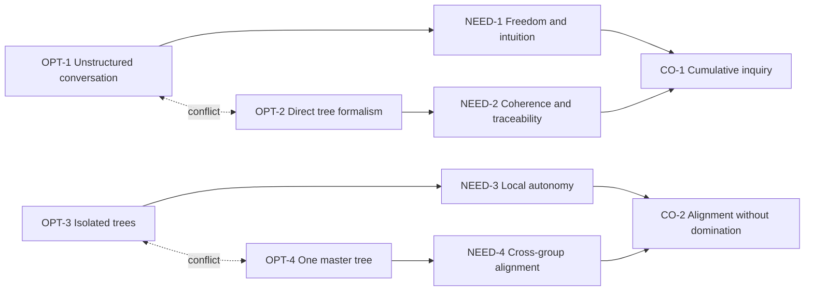

# Evaporating Clouds

## Purpose

Expose two linked conflicts that block cumulative and plural research.

## Cloud 1 — Conversation versus formal structure

### Entities

- CO-1 / A — Collective inquiry accumulates into coherent, revisable guidance.
- NEED-1 / B — Preserve spontaneous conversation, intuition, accessibility,
  and personal learning.
- NEED-2 / C — Preserve logical focus, traceability, cumulative progress, and
  alignment.
- OPT-1 / D — Keep research conversation outside tree constraints.
- OPT-2 / D′ — Require contributors to work directly in tree form.

### Assumptions

- Conversational freedom requires avoiding tree structure.
- Cumulative coherence requires every contributor to use tree formalism.
- No mediated layer can connect the two modes.

### Injection

INJ-1 — A dual-channel uptake loop: natural contribution → proposed delta →
contributor confirmation → governed human disposition.

## Cloud 2 — Local autonomy versus cross-group alignment

### Entities

- CO-2 / A — Align inquiry across people and groups without domination.
- NEED-3 / B — Preserve local goals, context, language, and autonomy.
- NEED-4 / C — Discover shared structure for coordination.
- OPT-3 / D — Keep trees isolated.
- OPT-4 / D′ — Merge trees into one authoritative everyone-level tree.

### Assumptions

- Autonomy requires isolation.
- Alignment requires a single merged authority.
- Agreement and disagreement cannot coexist in one representation.

### Injection

INJ-2 — Federated, provenance-preserving grafts with explicit interfaces,
local-only branches, retained disagreement, and exit.

## Logical connections

L-023–L-032 record the needs, believed prerequisites, and conflicts.

## Evidence

EVD-5 and EVD-6 support Cloud 1. EVD-7 and EVD-10 support Cloud 2.

## Confidence

High that Cloud 1 is active in the prompt; medium that Cloud 2 is yet an
operating conflict rather than a future design problem.

## Open reservations

- Who bears the mapping burden in the mediated layer?
- How does a contributor correct misrepresentation?
- What constitutes shared structure without shared authority?
- When does a graft become a new tree rather than a relationship between trees?

## Diagram

Text: the first conflict is dissolved by mediated uptake; the second by
federation rather than isolation or forced merger.

## Cross-tree references

INJ-1 and INJ-2 appear in the Future Reality and Prerequisite views. Their
negative branches are NBR-1–NBR-4.

