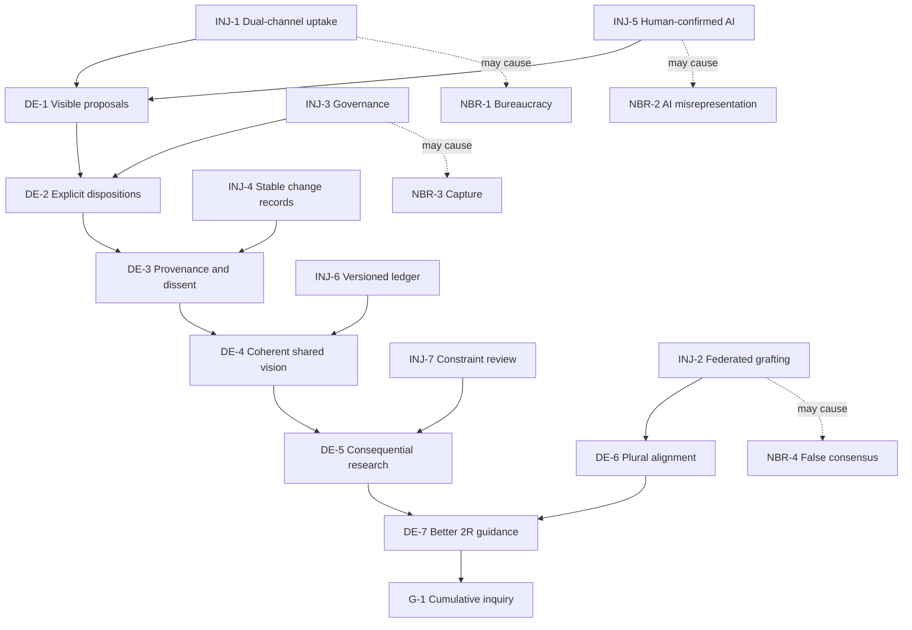

# Future Reality Tree

## Purpose

Test whether a governed contribution-to-model system could produce cumulative
2R research while preserving participation and plurality.

## Injections

- INJ-1 — Dual-channel natural-contribution-to-delta uptake.
- INJ-2 — Federated, provenance-preserving tree grafting.
- INJ-3 — Bounded stewardship and revision governance.
- INJ-4 — Stable source-linked change records.
- INJ-5 — AI assistance with contributor and reviewer confirmation.
- INJ-6 — Versioned contribution ledger and dependency propagation.
- INJ-7 — Regular uptake, model-quality, downstream-use, and constraint review.

## Desirable effects

- DE-1 — Natural contributions yield visible source-linked proposals.
- DE-2 — Material proposals receive explicit dispositions.
- DE-3 — Accepted changes preserve provenance and dissent.
- DE-4 — Shared vision becomes more coherent without suppressing personal
  development.
- DE-5 — Research is steered toward consequential gaps and assumptions.
- DE-6 — Groups coordinate without erasing local differences.
- DE-7 — 2R acts from a better tested and more complete model.

## Logical connections

```text
INJ-1 + INJ-5 → DE-1 → DE-2
INJ-3         → DE-2
INJ-4         → DE-3
DE-2 + DE-3 + INJ-6 → DE-4
DE-4 + INJ-7 → DE-5 → DE-7 → G-1
INJ-2 → DE-6 → DE-7
```

These are contributory hypotheses, not claims of sufficiency.

## Evidence

EVD-4–EVD-10 and the governance elements in EVD-14.

## Assumptions

ASM-25–ASM-31. The most important is that a mediated delta layer can reduce
formal burden without distorting contribution.

## Negative branches and trims

### NBR-1 — Bureaucracy suppresses inquiry

**Chain:** INJ-1 → formal intake expands → contributors self-censor or leave.

**Trim:** use progressive formality. Conversation remains unstructured; only
potentially consequential deltas receive full records. Measure contributor
burden and allow withdrawal.

### NBR-2 — AI misrepresents or inflates contributions

**Chain:** INJ-5 → plausible mapping is treated as authorial intent → false
significance enters review.

**Trim:** source excerpt, confidence, rival mappings, contributor confirmation,
and an explicit "no fit" outcome. AI has no adoption authority.

### NBR-3 — Steward or majority capture

**Chain:** INJ-3 → review power concentrates → minority objections disappear.

**Trim:** visible standing, reasoned dispositions, minority reports, appeal,
rotation, conflict-of-interest disclosure, and provisional status.

### NBR-4 — Grafting creates false consensus or mega-trees

**Chain:** INJ-2 → surface similarity drives merger → scope and assumptions are
lost.

**Trim:** pairwise grafts before global federation; retain source IDs, local
branches, disputed relationships, boundary metadata, reversibility, and exit.

## Confidence

Medium for the manual uptake system; low for cross-group federation until one
pairwise experiment exists.

## Open reservations

- Does governance latency exceed the value of model improvement?
- How are affected but absent parties represented?
- Which model changes should propagate to priorities and commitments?
- Can throughput reward epistemic value without Goodhart effects?

## Diagram



## Cross-tree references

The injections address RC-1–RC-5. IO-1–IO-7 provide their prerequisites.
ACT-1 tests the core manual loop before automation or grafting.

