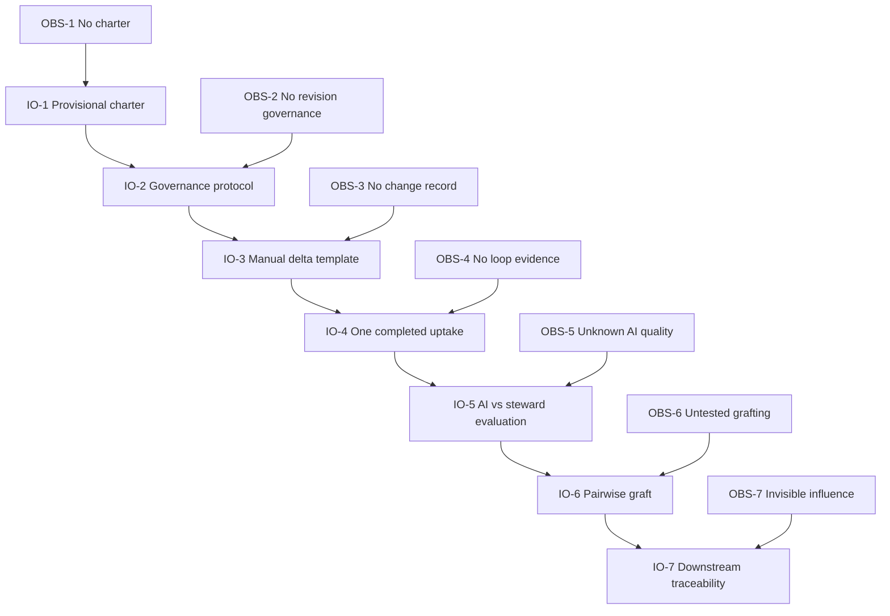

# Prerequisite Tree

## Purpose

Order the conditions required before automating contribution mapping or
federating trees.

## Entities

| Obstacle | Intermediate objective |
|---|---|
| OBS-1 — No explicit Research Circle charter | IO-1 — Provisional charter accepted for one cycle |
| OBS-2 — No accepted revision governance | IO-2 — Time-bounded roles and dispositions exist |
| OBS-3 — No contribution/change-record format | IO-3 — Manual source-linked delta template exists |
| OBS-4 — No end-to-end uptake evidence | IO-4 — One real contribution completes the loop |
| OBS-5 — AI quality and confirmation cost unknown | IO-5 — AI and steward mappings are compared |
| OBS-6 — Grafting semantics untested | IO-6 — One pairwise graft preserves plurality |
| OBS-7 — Downstream influence is invisible | IO-7 — Accepted changes trace to priorities and decisions |

## Logical connections

```text
IO-1 → IO-2 → IO-3 → IO-4 → IO-5 → IO-6 → IO-7
```

Obstacle/objective links L-056–L-068 accompany the dependency spine.

Automation is deliberately after a manual pilot. Grafting is after the group
has evidence that it can govern its own tree.

## Evidence

EVD-4, EVD-7, EVD-8, EVD-10, EVD-14, EVD-15, and EVD-16.

## Assumptions

- A provisional charter is enough to run one reversible pilot.
- Manual representation should precede schema or UI optimization.
- Human baseline mappings are needed before evaluating AI.
- A group should demonstrate internal model governance before federating.

## Confidence

High through IO-5; medium-to-low for the exact ordering of IO-6 and IO-7.

## Open reservations

- Safeguarding, privacy, and consent may need objectives before any capture.
- A canonical current 2R tree version may not exist.
- AI may be unnecessary if steward mapping cost is low.
- Downstream traceability could be tested before grafting.

## Diagram



Text: charter and governance enable a manual record and real pilot; pilot
evidence enables AI evaluation; a governed internal model enables a pairwise
graft; accepted changes are then traced downstream.

## Cross-tree references

IO-4 validates INJ-1, IO-5 validates INJ-5, and IO-6 validates INJ-2.

