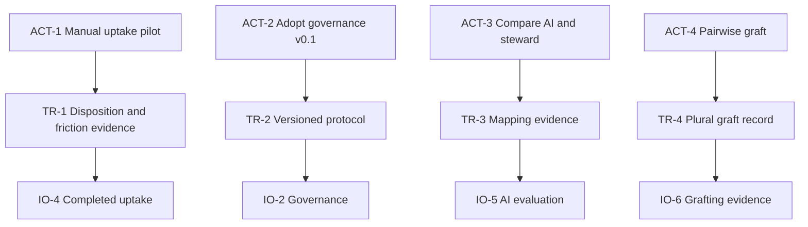

# Transition Tree

## Purpose

Turn the prerequisite objectives into evidence-producing actions.

## Transition 1 — Manual uptake pilot

**Transition ID:** ACT-1 / TR-1
**Current reality:** The prompt contains useful contributions and revision
questions, but no complete contribution-to-model disposition.
**Need:** Test the entire loop before designing a platform or permanent
governance.
**Action:** Select one recent Research Circle paper or session. Assign a
contributor, mapper/steward, and at least two reviewers. Use a one-page
provisional charter, governance rule, and delta template to map one material
contribution to the current 2R tree and dispose of it.
**Expected immediate effect:** TR-1 — One source-linked delta is accepted,
disputed, rejected, or deferred, and process frictions are recorded.
**Expected contribution:** Achieves IO-4 and tests RC-1, INJ-1, ASM-25, and the
candidate throughput definition.
**Prerequisites:** Identify a canonical tree version; participant consent;
time-box; provisional roles; source access.
**Verification:** Source excerpt, target IDs, proposed change, rationale,
objections, disposition, reviewer identities/standing, time spent, and next
model version are recorded.
**Likely scope:** one contribution, one branch, one review cycle.
**Risk:** Pilot rules are mistaken for permanent legitimacy.
**Rollback:** Mark all outputs provisional; preserve the source and prior model;
allow withdrawal and reversal.
**Traceability:** OBS-1–OBS-4 → IO-1–IO-4 → INJ-1 → CSF-1/CSF-2 → G-1.
**Confidence:** High.

## Transition 2 — Adopt governance v0.1

**Transition ID:** ACT-2 / TR-2
**Current reality:** Pilot governance is deliberately provisional.
**Need:** Incorporate observed friction before recurring use.
**Action:** Review the pilot with participants and affected stewards; revise
standing, dispositions, timing, appeal, minority reports, and conflicts of
interest; adopt v0.1 for a fixed number of cycles.
**Expected immediate effect:** TR-2 — A versioned protocol has named roles,
standing, dispositions, review timing, and appeal.
**Expected contribution:** Achieves IO-2 and enables repeated uptake.
**Prerequisites:** TR-1 and participant feedback.
**Verification:** Version, decision record, dissent, expiry/review date, and
owner are recorded.
**Likely scope:** governance document and change log.
**Risk:** Early participants entrench themselves.
**Rollback:** Sunset clause, rotation, and explicit re-ratification.
**Traceability:** OBS-2 → IO-2 → INJ-3 → CSF-2 → G-1.
**Confidence:** High.

## Transition 3 — Evaluate AI assistance

**Transition ID:** ACT-3 / TR-3
**Current reality:** Automated alignment suggestions are reported as
insufficiently poignant; no baseline exists.
**Need:** Learn where AI reduces work and where it distorts meaning.
**Action:** Independently map the pilot contribution by a human steward and an
AI assistant, then compare target nodes, proposed deltas, omitted evidence,
false positives, rival interpretations, and correction time.
**Expected immediate effect:** TR-3 — Mapping accuracy, correction effort,
failure modes, and confirmation needs are evidenced.
**Expected contribution:** Achieves IO-5 and bounds INJ-5.
**Prerequisites:** IO-4, stable IDs, source-preserving template, contributor
confirmation.
**Verification:** Blind comparison and correction log.
**Likely scope:** one to three contributions.
**Risk:** A tiny sample is treated as general validation.
**Rollback:** Keep AI advisory-only and publish the coverage limit.
**Traceability:** OBS-5 → IO-5 → INJ-5 → DE-1.
**Confidence:** Medium.

## Transition 4 — Pairwise grafting experiment

**Transition ID:** ACT-4 / TR-4
**Current reality:** Individual/group/everyone grafting is a conceptual vision
without tested semantics.
**Need:** Test plurality on two real models before designing an everyone tree.
**Action:** With one aligned peer group, select one bounded branch and map
shared entities, incompatible assumptions, local-only conditions, disputed
links, provenance, governance boundaries, and exit conditions.
**Expected immediate effect:** TR-4 — One graft preserves agreement,
difference, provenance, and reversibility.
**Expected contribution:** Achieves IO-6 and tests INJ-2.
**Prerequisites:** Both groups govern their own models; consent and scope;
stable IDs; no automatic merge.
**Verification:** Each group can recover its original tree; disagreements
remain visible; no entity silently changes meaning.
**Likely scope:** one branch across two group trees.
**Risk:** False consensus or negotiation overhead.
**Rollback:** Delete only the graft relationship; retain both source models.
**Traceability:** OBS-6 → IO-6 → INJ-2 → CSF-4 → G-1.
**Confidence:** Low.

## Logical connections

Text: manual uptake first; governance revision second; AI evaluation third;
cross-group grafting only after internal governance evidence.

## Evidence

EVD-4, EVD-5, EVD-7, EVD-8, EVD-10, and EVD-14–EVD-16.

## Assumptions

One bounded pilot can reveal enough about process viability to justify or
redirect later work.

## Open reservations

Owners, participants, meeting artifacts, the canonical current tree, and an
external partner remain unspecified.

## Cross-tree references

ACT-1 is the recommended next action. ACT-2–ACT-4 should be revised from its
evidence rather than treated as a fixed roadmap.

